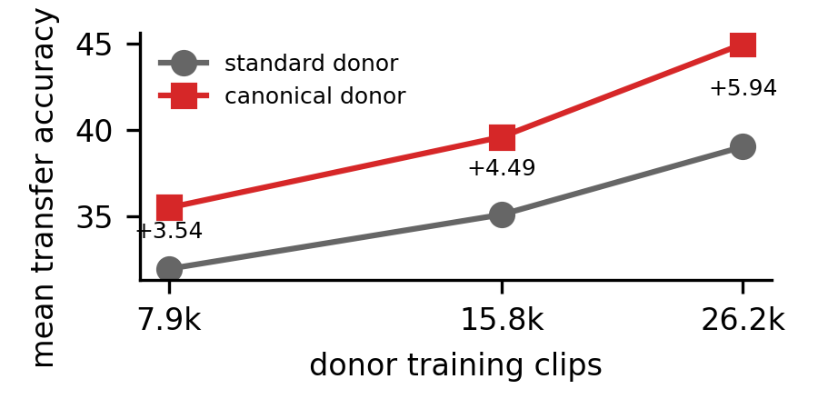
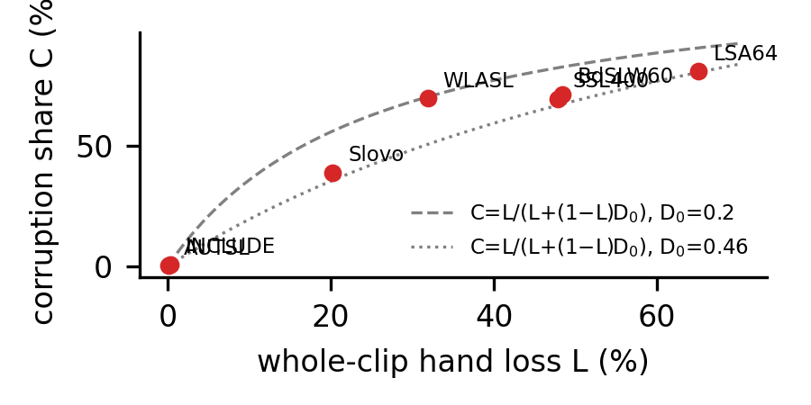

# signcanon

**Dominance canonicalization for few-shot cross-lingual sign language transfer** — companion code,
split definitions and every result for

> Matteo Lanza. *Using Sign Phonology to Improve Few-Shot Cross-Lingual Transfer Learning for Sign
> Language Recognition.* Workshop on Sign Language Processing (WSLP), 2026.

## The idea

A pose-based recogniser represents the two hands as separate halves of a skeleton graph, so a
left-dominant and a right-dominant signer produce the same sign as mirror images and the model must
learn every sign in both orientations. Which hand leads is a fact about the signer, not the sign.
We therefore **canonicalize dominance**: any training clip whose left hand carries clearly more
motion energy (e_L > 1.2 · e_R) is mirrored — the hand blocks and the left/right body nodes are
swapped and x is negated. The mirror is an exact automorphism of the skeleton graph, so nothing is
lost or added; only which clips flip changes.

A CTR-GCN donor trained on Turkish Sign Language (AUTSL) in the canonical frame transfers to six
other sign languages **+6.01 accuracy points** better than a standard donor under full fine-tune
and **+5.19** under frozen prototypes (four vs four donors, exact permutation p = 1/70, every
canonical donor above every standard donor, gain positive on all six recipients), at no cost in the
donor's own language. The paper then measures *why* with nine donor-training variants that contain
identical data and differ only in which clips are mirrored, and audits the motion-energy rule
itself: across seven corpora 0.12–65.1% of clips never have a hand detected, so up to 80.7% of
apparently one-handed clips are tracking artifacts.



## What is here

```
src/signcanon/
  skeleton.py     node layout, skeleton edges, the mirror permutation, automorphism check
  canon.py        the operator, and every variant recipe in the paper (Table 8)
  validity.py     hand-presence and the whole-clip loss census
  data.py         corpus loading, the donor split, signer-disjoint k-shot episodes
  model.py        CTR-GCN builder (uses the official repo, see below)
  adapt.py        the two adaptation regimes: full fine-tune and frozen prototypes
  evaluate.py     donor-level effect: exact permutation test, noise floor, t interval
experiments/
  train_donor.py         one flag per recipe: standard, canonical, all-left, random-fraction,
                         signer-blocked, gloss-blocked, signer-majority, flip-aug, unconditional flip
  evaluate_transfer.py   k-shot evaluation on the 90-cell grid; --from-scratch for the no-donor baseline
  compare_donors.py      the headline statistics and per-recipient gains
  audit_tracking.py      the tracking census (Table 3)
paper_results/           every cell-level grid and aggregate in the paper, as JSON (see its README)
splits/                  the donor split and every episode's support/test clips, per corpus
staging/                 featurisation + the extraction scripts and staging rules (no pose data)
SEEDS.md                 seed-to-recipe map (Table 8)
tests/                   33 property tests
```

The model is the official **CTR-GCN** (Chen et al., ICCV 2021), unmodified: clone
[Uason-Chen/CTR-GCN](https://github.com/Uason-Chen/CTR-GCN) and pass its path as `--ctrgcn-repo`;
`signcanon.model` injects the 49-node graph. Input to the model is a 49-node, 2-D skeleton over 32
frames — x/y only; MediaPipe's z channel and confidences are discarded (Appendix C.2).

## Reproduce the paper's numbers from the shipped results (no GPU)

```bash
pip install -e .
python experiments/compare_donors.py \
  --results paper_results/cells/s{0,1,2,3}_standard_rawrecipients.json \
            paper_results/cells/s{90,94,12,13}_canonical_canonrecipients.json \
  --control 0 1 2 3 --treatment 90 94 12 13
# effect +6.01  noise floor 0.80 (7.5x)  95% CI [+4.62, +7.40]  p one-sided 1/70, two-sided 2/70
```

`--method proto` gives +5.19; `paper_results/README.md` maps every file to the table it feeds and
shows the 54-cell variant comparisons (e.g. the unconditional-flip donor, +5.56).

## Reproduce from scratch

Data is not redistributed (several licences forbid it); `staging/` documents how each corpus becomes
a single `.npz` with `X: float32 (N, 2, 32, 49)`, `y: int (N,)`, `sg: str (N,)`.

```bash
git clone https://github.com/Uason-Chen/CTR-GCN ctrgcn

# donors (seeds identify recipes - SEEDS.md)
for s in 0 1 2 3;       do python experiments/train_donor.py --data data/autsl.npz --ctrgcn-repo ctrgcn \
  --seed $s --out checkpoints/s$s.pt; done
for s in 90 94 12 13;   do python experiments/train_donor.py --data data/autsl.npz --ctrgcn-repo ctrgcn \
  --seed $s --canonical --out checkpoints/s$s.pt; done

# the 90-cell headline grid: six recipients x k in {1,5,10} x episode seeds 0-4
for s in 0 1 2 3;       do python experiments/evaluate_transfer.py --donor checkpoints/s$s.pt --donor-id $s \
  --ctrgcn-repo ctrgcn --targets data/{bdslw60,slovo,lsa64,include_oh,wlasl_oh,ssl400}.npz \
  --eval-seeds 0 1 2 3 4 --out results/s$s.json; done
for s in 90 94 12 13;   do python experiments/evaluate_transfer.py --donor checkpoints/s$s.pt --donor-id $s \
  --ctrgcn-repo ctrgcn --targets data/{bdslw60,slovo,lsa64,include_oh,wlasl_oh,ssl400}.npz \
  --eval-seeds 0 1 2 3 4 --canonical --out results/s$s.json; done

python experiments/compare_donors.py --results results/*.json --control 0 1 2 3 --treatment 90 94 12 13
```

Canonical donors are evaluated with `--canonical` (recipient clips canonicalized, their native
frame); standard, flip-augmentation, unconditional-flip and no-donor arms see raw recipients. The
mechanism variants (Table 2) use episode seeds 0 1 2 and the flags listed in `SEEDS.md`; the
no-donor baseline (Appendix A.5) is `evaluate_transfer.py --from-scratch --budgets 30 60`.

Donor training follows Appendix C.2 exactly: 35 epochs, SGD (lr 0.1, Nesterov momentum 0.9, weight
decay 4e-4), batch 256, five warm-up epochs then ×0.1 at 60% and 85%, label smoothing 0.1, nine
signers held out (28 signers / 26,157 clips on AUTSL). Recipient fine-tuning: 30 epochs, SGD (lr
0.01, momentum 0.9, weight decay 1e-4), batch 128.

## The tracking census

```bash
python experiments/audit_tracking.py --corpora data/*.npz
```

prints Table 3 — per corpus, the whole-clip hand loss (0.12% AUTSL to 65.1% LSA64), the decidable
fraction and the corruption share (the fraction of rule-decidable clips whose decision was forced by
a missing hand) — plus the flip rate and how many clips have fractional hand presence. The census
counts a hand as missing when present in fewer than half the frames; on all seven corpora per-clip
presence is exactly 0 or 1 (the last column is zero), so this coincides with "never detected in any
frame". `canon.robust_flip_decisions` (judge only from co-visible frames) is an auxiliary tool and
is not used for any number in the paper.



## Tests

```bash
PYTHONPATH=src pytest
```

Thirty-three property tests: the mirror permutation is an exact automorphism (48 edges preserved,
involution, nose the only fixed point); every variant recipe is a per-clip choice between a clip
and its mirror image; the blocked recipes are constant within signer/gloss and hit their target
rate; the no-donor path loads no weights; the exact test and noise floor match hand calculations;
the donor split holds out exactly nine signers.

## License and citation

MIT for the code in this repository; CTR-GCN and every corpus carry their own licences. Cite the
paper (see `CITATION.cff`).
