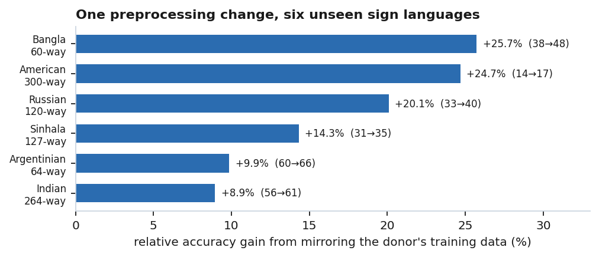
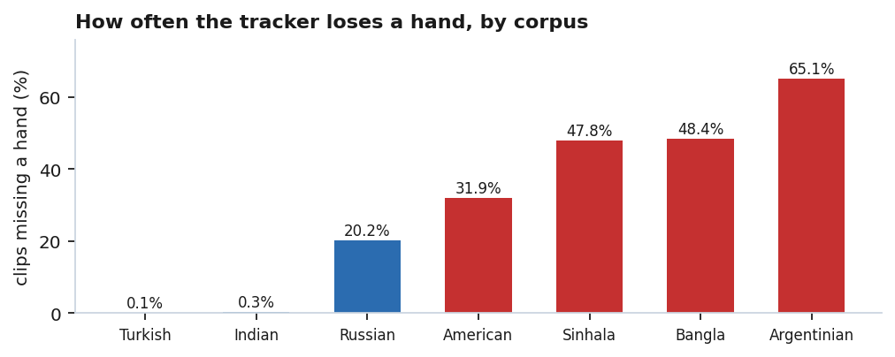
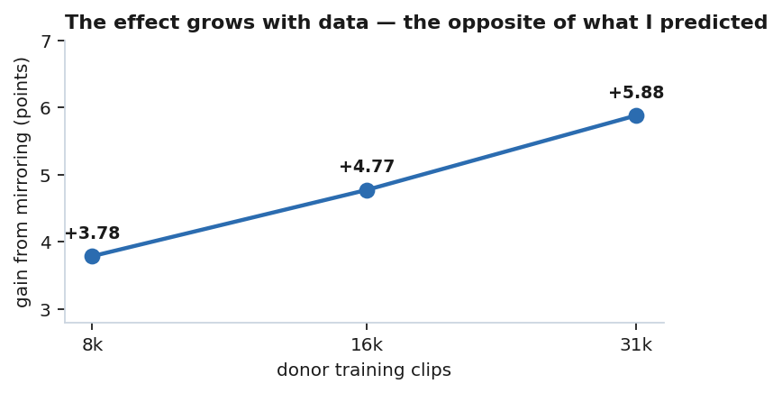

# signcanon

**Hand-dominance canonicalization for cross-lingual sign language transfer, and the
tracking-failure audit that keeps it honest.**

Companion code for the write-up *[Which Hand Is Not in the Lexicon](https://matteolanzablog.com)*.

## The idea in three sentences

No sign language distinguishes two words by which hand performs them, so a recogniser is free to
mirror every clip until the busy hand is always on the same side, and because skeleton networks
have per-node parameters, this stops the model having to learn every sign twice. Training a CTR-GCN
donor on Turkish Sign Language in this canonical frame improves few-shot transfer to six other sign
languages by **+5.9 accuracy points** (5.8x the donor-to-donor noise floor, positive in 6/6
languages) while changing nothing within Turkish itself. The decision rule, however, can be silently
hijacked by the pose tracker, because a hand the tracker lost looks perfectly still and perfectly
still looks non-dominant, so this repo also ships the audit that measures the damage and a robust
rule that only judges from frames where both hands were actually seen.



## What is here

```
src/signcanon/
  skeleton.py    node layout, skeleton edges, the mirror permutation, automorphism check
  canon.py       the transform: naive, mixture-controlled, and tracking-robust variants
  validity.py    hand-presence and dropout measurement
  data.py        corpus loading, signer-disjoint splits, k-shot episode construction
  model.py       CTR-GCN builder (uses the official repo, see below)
  adapt.py       the two adaptation methods: full fine-tune and frozen prototypes
  evaluate.py    donor-level paired comparison with an exact permutation test
experiments/
  train_donor.py         train a donor (standard / canonical / controlled mixture / subsampled)
  evaluate_transfer.py   k-shot evaluation of a donor across target corpora
  compare_donors.py      the headline table: donor-level effect + per-language gains
  audit_tracking.py      dropout census + how many mirror decisions the tracker forced
tests/                   properties the results depend on (17 tests)
```

The model itself is the official **CTR-GCN** (Chen et al., ICCV 2021). This repo deliberately does
not vendor it. Clone [Uason-Chen/CTR-GCN](https://github.com/Uason-Chen/CTR-GCN) and pass its path
via `--ctrgcn-repo`; `signcanon.model` injects the 49-node skeleton graph and builds the model
unmodified.

## Data

No corpora are redistributed here (several licences forbid it). Each corpus is a single `.npz` with:

```
X  : float32 (N, 2, 32, 49)   x,y × frames × nodes, shoulder-centred
y  : int     (N,)             word label
sg : str     (N,)             signer id
```

Nodes: `0` nose · `1-6` shoulders/elbows/wrists (L/R pairs) · `7-27` left hand · `28-48` right hand.
Sources used in the write-up: AUTSL (donor), WLASL, INCLUDE, LSA64, Slovo, BdSLW60, SSL400. Check
their respective licences before use.

## Reproduce the headline

```bash
pip install -e .
git clone https://github.com/Uason-Chen/CTR-GCN ctrgcn

for s in 0 1 2 3;   do python experiments/train_donor.py --data data/autsl.npz \
  --ctrgcn-repo ctrgcn --seed $s --out checkpoints/std_$s.pt; done
for s in 10 12 13;  do python experiments/train_donor.py --data data/autsl.npz \
  --ctrgcn-repo ctrgcn --seed $s --canonical --out checkpoints/canon_$s.pt; done

for s in 0 1 2 3;   do python experiments/evaluate_transfer.py --donor checkpoints/std_$s.pt \
  --donor-id $s --ctrgcn-repo ctrgcn --targets data/*.npz --out results/std_$s.json; done
for s in 10 12 13;  do python experiments/evaluate_transfer.py --donor checkpoints/canon_$s.pt \
  --donor-id $s --ctrgcn-repo ctrgcn --targets data/*.npz --canonical --out results/canon_$s.json; done

python experiments/compare_donors.py --results results/*.json --control 0 1 2 3 --treatment 10 12 13
```

Expected: effect is about **+5.9** full fine-tune / +4.6 prototype, exact permutation p = 0.029 (the floor
of a 3-vs-4 design), positive in every target language.

## The audit

```bash
python experiments/audit_tracking.py --corpora data/*.npz
```

reports, per corpus: how often each hand is entirely untracked (0.1%–65% across the corpora above),
and what fraction of the mirror rule's decisions were forced by a missing hand rather than made by
the signer (37% of flips in BdSLW60; 67% of non-flips in LSA64). `robust_canonicalize` is the ~20-line
repair: it judges dominance only from frames where both hands are visible, and abstains below eight
such frames.



## Scaling



The gain **grows** with donor size (+3.8 at 8k clips, +5.9 at 31.6k), so the transform is not a
crutch for an under-trained model. `train_donor.py --subsample N` and `--mixture F` reproduce both
sweeps.

## Tests

```bash
pytest
```

Seventeen property tests, including the fact the whole method rests on: the mirror permutation is an
exact automorphism of the skeleton graph (all 48 edges preserved, involution, nose the only fixed
point), so mirroring is representation-preserving by construction.

## License

MIT for the code in this repository. The CTR-GCN model and all corpora carry their own licences.
